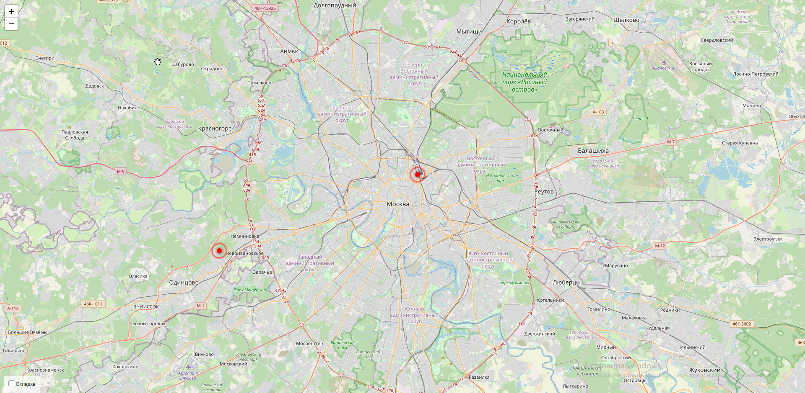

# Сайт о достопримечательностях Москвы

## Оглавление

* [Описание проекта](#описание-проекта)
    * [Предварительные требования](#предварительные-требования)
    * [Установите зависимости](#установите-зависимости)
* [Запуск сайта](#запуск)
    * [Настройки](#настройки)
* [Источники данных](#источники-данных)
    * [load_place.py](#load_placepy)
    * [Пример запуска](#Пример-запуска)
    * [Доступные ссылки для перехода на странице](#доступные-ссылки-для-перехода-на-странице)

## Описание проекта

Данный скрипт позволяет выводить карту с метками на ней и получнием по нажатию на метку краткой информации в удобном формате.

Можно удалять и добавлять метки на карту.

### Предварительные требования:

1. Установленный [Python](https://www.python.org/downloads/) версии 3.11 и выше.
2. pip - установщик пакетов Python.
3. Доступ к Интернету.

### Установите зависимости

С активированным виртуальным окружением установите зависимости проекта:

```bash
pip install -r requirements.txt
```

## Запуск сайта

Чтобы запустить проект, откройте его папку и запустите миграции:

```bash
python manage.py migrate
```

После этого запустите сервер:

```bash
python manage.py runserver
```

Сервер откроется по этому [адресу](http://127.0.0.1:8000).

### Настройки

Также для корректной работы сайта необходимо задать переменные окружения. Для этого нужно создать файл .env и заполнить его так:

```
SECRET_KEY=Секретный ключ проекта установки Django
ALLOWED_HOSTS=Список строк, представляющих хост/сервер, который обслуживается этим проектом (задается в формате "str1, str2, str3")
```

## Источники данных

Программа берет информацию из .json-файлаов, распологающегося по адресу '/static/places', пример которого выглядит так:

```json
{
    "title": "Экскурсионный проект «Крыши24.рф»",
    "imgs": [
        "https://raw.githubusercontent.com/devmanorg/where-to-go-places/master/media/af7b8599fec9d2542a011f1d01d459e2.jpg",
        "https://raw.githubusercontent.com/devmanorg/where-to-go-places/master/media/965c5a3ff5b2431e646d30b6744afd2d.jpg",
        "https://raw.githubusercontent.com/devmanorg/where-to-go-places/master/media/06868b2b01ff8db506cd21956a6cb636.jpg",
    ],
    "description_short": "Хотите увидеть Москву с высоты и разделить яркие впечатления с друзьями? В этом поможет проект «Крыши24.рф». Вы можете выбрать крышу из множества интересных вариантов и провести там свидание, вечеринку, творческое занятие, фотосессию или что-то ещё.",
    "description_long": "<p>Проект «Крыши24.рф» проводит экскурсии и мероприятия на крышах, откуда...</p>
    "coordinates": {
        "lng": "37.32478399999957",
        "lat": "55.70731600000015"
    }
}
```

### load_place.py

Для того, чтобы загрузить данные про новые места, можно использовать функцию `load_place.py`. Способ применения:

```bash
python manage.py load_place [url]
```

Url - это адрес json-файла в интернете. Файл должен полностью соответствовать структуре примера.

### Пример запуска

Выглядеть сайт будет так:



### Доступные ссылки для перехода на странице

Сnраницы по которым можно переходить:

* [/](http://127.0.0.1:8000/)
* [/admin](http://127.0.0.1:8000/admin/places/place)
* [/places/<place_id>/](http://127.0.0.1:8000/places/1/) 

```
http://127.0.0.1:8000/places/<place_id>
```

place_id - id метки в БД
